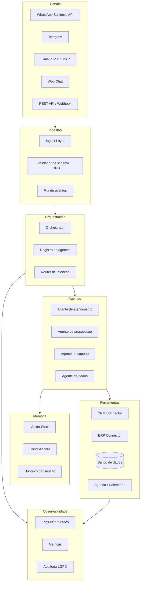

# Arquitetura de Referência — Hermes Agents

> Documento técnico para times de produto, engenharia e operações.  
> Versão 1.0 — 2026-08-23

---

## 1. Visão geral do sistema

Hermes Agents é uma camada de agentes autônomos que opera sobre um núcleo LLM, com orquestração multi-agente, memória persistente e conectores de canal/mensageria. A arquitetura é modular: cada componente pode ser substituído ou estendido sem reescrever o núcleo.

Princípios de design:
- **Orquestração explícita, não implícita.** Nenhum agente atua sem um plano visível e um fluxo de execução rastreável.
- **Human-in-the-loop por padrão em ações críticas.** Aprovação humana antes de disparar comunicações externas, alterar registros financeiros ou modificar regras de negócio.
- **Dados soberanos.** Clientes retêm propriedade dos dados; o agente apenas processa e consulta.
- **Observabilidade first-class.** Cada ação gera log estruturado, métricas e rastreabilidade por sessão.

---

## 2. Diagrama de arquitetura

---

## 3. Componentes

### 3.1 Ingest Layer
Responsável por receber eventos de múltiplos canais, normalizar formato, validar schema e aplicar sanitização LGPD.

Responsabilidades:
- Transformação de formatos proprietários (ex.: WhatsApp Business API `messages` payload, Telegram `update`) para um envelope canônico.
- Validação de campos obrigatórios e recusa de payloads inválidos.
- Mascaramento de dados sensíveis (CPF, e-mail, telefone) antes de indexação.
- Publicação em fila (`events.queue`) com particionamento por `tenant_id` e `channel`.

Stack sugerido: FastAPI + Pydantic + Redis Streams ou AWS SQS.

### 3.2 Orchestrator
Cérebro operacional. Recebe um envelope canônico, classifica a intenção, seleciona o agente adequado e coordena o plano de execução.

Responsabilidades:
- Classificação de intenção (LLM pequeno ou modelo de classificação fine-tuned).
- Seleção de agente por skill, disponibilidade e perfil do usuário.
- Construção de plano (planner) com passos ordenados e dependências.
- Validação de pré-condições antes de cada passo.
- Tratamento de exceções e fallback para humano.
- Persistência do plano e status de cada passo no Context Store.

Stack sugerido: Python + LangGraph ou Celery + Redis, ou implementação customizada com `asyncio`.

### 3.3 Agentes (Workers)
Unidades especializadas de execução. Cada agente tem:
- Prompt base com persona, limites e regras de negócio.
- Toolbelt: conjunto de ferramentas permitidas (ex.: consultar CRM, criar lead, enviar e-mail).
- Memória de curto e longo prazo (contexto da sessão + histórico persistido).
- Política de retry e timeout por ferramenta.

Agentes padrão:
| Agente | Função | Ferramentas |
|---|---|---|
| Atendimento | Responder perguntas, qualificar leads | CRM, Knowledge Base |
| Prospecção | Iniciar conversas, follow-up | WhatsApp, E-mail, CRM |
| Suporte | Resolver tickets, escalar | ERP, Agenda |
| Dados | Consultar métricas, gerar relatórios | BI, Planilhas, DB |

### 3.4 Memória
Duas camadas:
- **Vector Store:** busca semântica por embeddings de conversas, documentos e políticas. Ex.: Qdrant, Pinecone, pgvector.
- **Context Store:** chave-valor para estado da sessão, variáveis de fluxo e cache de lookups frequentes. Ex.: Redis, PostgreSQL.

Política de retenção:
- Sessões ativas: 30 dias.
- Sessões encerradas: agregar embeddings e manter 90 dias.
- Dados sensíveis: exclusão sob-request em até 72h (LGPD).

### 3.5 Conectores (Adapters)
Camada de integração com sistemas externos. Cada conector implementa:
- Autenticação (OAuth2, API Key, mTLS).
- Mapeamento de schema local → schema canônico.
- Retry com backoff exponencial.
- Circuit breaker para evitar cascata de falhas.

Conectores obrigatórios:
- **WhatsApp Business API:** envio/recebimento de mensagens, upload de mídia, webhook verification.
- **Telegram:** Bot API, polling ou webhook.
- **E-mail:** SMTP para envio, IMAP/Graph API para leitura.
- **CRM:** REST/GraphQL com mapeamento de entidades (lead, contato, oportunidade).
- **ERP:** SOAP/REST dependendo do sistema (SAP, Totvs, Senior).

### 3.6 Observabilidade
Stack mínima:
- **Logs estruturados:** JSON com campos `tenant_id`, `agent_id`, `session_id`, `trace_id`, `action`, `status`, `latency_ms`. Enviar para ELK, Loki ou Datadog.
- **Métricas:** contadores de `messages_received`, `messages_sent`, `tool_calls`, `tool_errors`, `human_handoffs`. Exportar via Prometheus.
- **Tracing:** OpenTelemetry para rastrear um evento desde o canal até a ferramenta final.
- **Auditoria:** tabela `audit_log` com `tenant_id`, `user_id`, `action`, `before`, `after`, `timestamp`.

---

## 4. Fluxo de dados

### 4.1 Fluxo happy path (WhatsApp → CRM)

1. Cliente envia mensagem pelo WhatsApp.
2. WhatsApp Business API recebe e encaminha para webhook do Hermes.
3. Ingest Layer valida payload, mascarar PII e publica `event=message.inbound` na fila.
4. Orchestrator consome evento, classifica intenção como `nova_consulta` e seleciona `Agente de atendimento`.
5. Agente carrega contexto do usuário (últimas interações, perfil no CRM).
6. Agente decide qualificar lead: chama ferramenta `crm.create_lead`.
7. CRM retorna `lead_id`. Agente envia resposta ao usuário via WhatsApp.
8. Ações são registradas no Log e métricas atualizadas.

### 4.2 Fluxo de erro e fallback

- Se classificação de intenção for ambígua (< 0.7 confiança): pergunta esclarecimento ao usuário.
- Se ferramenta falhar 3x: aciona alerta e transfere para humano com contexto completo.
- Se payload violar schema: retorna HTTP 400 para o canal (quando aplicável) e loga alerta de segurança.

---

## 5. Stack tecnológico recomendado

| Camada | Tecnologia | Observações |
|---|---|---|
| API Gateway / Webhook | FastAPI / Cloudflare Workers | Validação de webhook, rate limit, WAF |
| Ingestão | Redis Streams / AWS SQS | Particionamento por tenant |
| Orquestração | LangGraph / Celery / Temporal | Escolha conforme complexidade de workflow |
| LLM | GPT-4o / Claude 3.5 / Llama 3 fine-tuned | Fallback para modelo menor em tarefas simples |
| Vector Store | Qdrant / pgvector | Escala horizontal e filtros por tenant |
| Context Store | Redis / PostgreSQL | Sessões e cache |
| Conectores | Python SDK + httpx / aiohttp | Retry, circuit breaker, mTLS |
| Observabilidade | OpenTelemetry + Prometheus + Loki | Tracing, métricas, logs |
| Deploy | Docker + Kubernetes / Railway | Isolamento por tenant com namespaces |
| Segurança | HashiCorp Vault / AWS Secrets Manager | Rotação de chaves, segredos |

---

## 6. Governança e LGPD

- Dados sensíveis nunca saem do ambiente do cliente sem anonimização.
- Cada tenant tem isolamento lógico (schema separado ou RLS no banco).
- Logs não armazenam conteúdo de mensagens sensíveis; armazenam apenas metadados operacionais.
- Exclusão de dados: endpoint `/v1/privacy/delete` que remove embeddings, contextos e registros relacionados em até 72h.
- Consentimento: registrar `consent_token` por sessão; se revogado, interromper processamento.

---

## 7. Checklist de implementação mínima

- [ ] Webhook do canal principal (WhatsApp) respondendo com `200 OK` em < 3s.
- [ ] Envelope canônico validado com Pydantic.
- [ ] Classificação de intenção com confiança mínima configurável.
- [ ] Agente de atendimento com toolbelt de CRM funcional.
- [ ] Memória de sessão carregando contexto nas primeiras 500ms.
- [ ] Logs estruturados com trace_id.
- [ ] Métricas básicas no Prometheus.
- [ ] Exclusão de dados funcionando em ambiente de teste.
- [ ] Modo dry-run para testes sem enviar mensagens externas.
- [ ] Documentação de runbooks para incidentes comuns.
